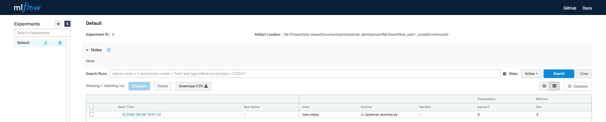
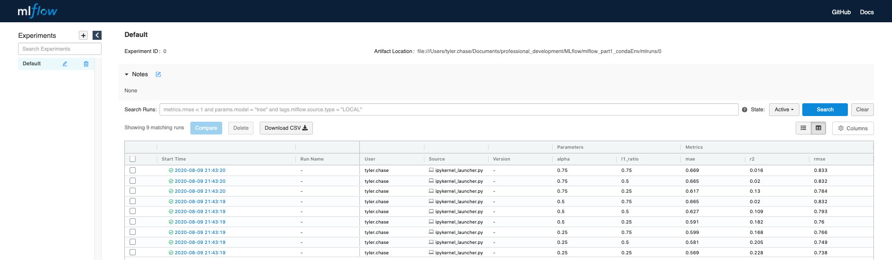
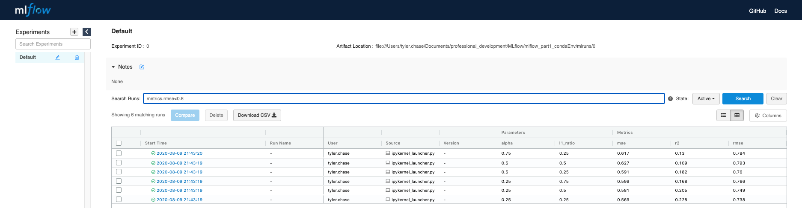

Introduction to MLflow for MLOps Part 1: Anaconda Environment
=============================================================

Medium Blog: https://medium.com/p/1fd9e299226f

After following along with the demos in this three part repository you will be able to:

* Understand how you and your Data Science teams can improve your MLOps practices using MLflow
* Use all Components of MLflow (Tracking, Projects, Models, Registry)
* Use MLflow in an Anaconda Environment
* Use MLflow with a Docker Environment (including running an IDE inside of a container)
* Use Postgre Backend Store and Minio Artifact Store for Easy Collaboration

The instructions/demos below assume you are using a Mac OSX operating system. Other operating systems can be used with minor modifications. 

|

Table of Contents:
==================
Part 1: Anaconda Environment (https://github.com/Noodle-ai/mlflow_part1_condaEnv)
---------------------------------------------------------------------------------

1. What is MLflow and Why Should You Use It?
2. Using MLflow with a Conda Environment 

Part 2: Docker Environment (https://github.com/Noodle-ai/mlflow_part2_dockerEnv)
--------------------------------------------------------------------------------

1. Using MLflow with a Docker Environment

Part 3: Database Tracking, Minio Artifact Storage, and Registry (https://github.com/Noodle-ai/mlflow_part3_PostgresMinioRegistry)
---------------------------------------------------------------------------------------------------------------------------------

1. Running MLflow with a PostgreSQL Database and Minio Artifact Store
2. MLflow Model Registry

|

1. What is MLflow and why should you use it?
============================================

|

Concepts
--------
MLflow is organized into four components (Tracking, Projects, Models, and Registry). You can use each of these components on their own but they are also designed to work well together. MLflow is designed to work with any machine learning library, determine most things about your code by convention, and require minimal changes to integrate into an existing codebase. It aims to take any codebase written in its format and make it reproducible and reusable by multiple data scientists. MLflow lets you train, reuse, and deploy models with any library and package them into reproducible steps that other data scientists can use as a “black box”, without even having to know which library you are using. 

|

Productivity Challenges in Machine Learning
-------------------------------------------

|

It is difficult to keep track of experiments
^^^^^^^^^^^^^^^^^^^^^^^^^^^^^^^^^^^^^^^^^^^^
If you are just working with a script or notebook, how do you tell which data, code, and parameters went into getting a particular model result?

|

It is difficult to reproduce code
^^^^^^^^^^^^^^^^^^^^^^^^^^^^^^^^^
Even if you have meticulously tracked the code versions and parameters, you need to capture the whole environment (e.g. library dependencies) to get the same result. This is especially challenging of you want another data scientist to use your code, or if you want to run the same code at scale on another platform (e.g. in the cloud).

|

There’s no standard way to package and deploy models
^^^^^^^^^^^^^^^^^^^^^^^^^^^^^^^^^^^^^^^^^^^^^^^^^^^^
Every data science team comes up with its own approach for each ML library it uses, and the link between a model and the code and parameters that produced it is often lost.

|

There’s no central store to manage models (their version and stage transitions)
^^^^^^^^^^^^^^^^^^^^^^^^^^^^^^^^^^^^^^^^^^^^^^^^^^^^^^^^^^^^^^^^^^^^^^^^^^^^^^^
A data science team creates many models. In the absence of a central place to collaborate and manage model lifecycle, data science teams face challenges in how they manage models and stages.

|

MLflow Components
-----------------

|

MLflow Tracking
^^^^^^^^^^^^^^^
This is an API and UI for logging parameters, code versions, metrics, and artifacts when running your machine learning code and later for visualizing results. You can use MLflow Tracking in any environment (e.g. script or notebook) to log results to local files or to a server, then compare multiple runs. Teams can use MLflow tracking to compare results from different users. 

|

MLflow Projects
^^^^^^^^^^^^^^^
MLflow Projects are a standard format for packaging reusable data science code. Each project is simply a directory with code, and uses a descriptor file to specify its dependencies and how to run the code. For example, a project can contain a conda.yaml for specifying a Python Anaconda Environment.

|

MLflow Models
^^^^^^^^^^^^^
MLflow Models offer a convention for packaging machine learning models in multiple flavors, and a variety of tools to help deploy them. Each model is saved as a directory containing arbitrary files and a descriptor file that lists several “flavors” the model can be used in. For example, a Tensorflow model can be loaded as a TensorFlow DAG, or as a python function to apply to input data. 

|

MLflow Registry
^^^^^^^^^^^^^^^    
MLflow Registry offers a centralized model store, set of APIs, and UI, to collaboratively manage the full lifecycle of an MLflow model. It provides model lineage (which MLflow experiment and run produced the model), model versioning, stage transitions (for example from staging to production or archiving), and annotations. 

|

Scalability and Big Data
------------------------
An individual MLflow run can execute on a distributed cluster. You can launch runs on the distributed infrastructure of your choice and report results to a tracking server to compare them. 

MLflow supports launching multiple runs in parallel with different parameters, for example for hyperparameter tuning. You can use the Projects API to start multiple runs and the tracking API to track them. 

MLflow Projects can take input from, and write output to, distributed storage systems such as AWS S3. This means that you can write projects that build large datasets, such as featurizing a 100TB file. 

MLflow Model Registry offers large organizations a central hub to collaboratively manage a complete model lifecycle. Many data science teams within an organization develop hundreds of models, each model with its experiments, runs, versions, artifacts, and stage transitions. 

|

Example Use Cases
-----------------

|

Individual Data Scientists
^^^^^^^^^^^^^^^^^^^^^^^^^^
Individual data scientists can use MLflow Tracking to track experiments locally on their machine, organize code in projects for future reuse, and output models that production engineers can then deploy using MLflow’s deployment tools. 

|

Data Science Teams
^^^^^^^^^^^^^^^^^^
Data science teams can deploy an MLflow Tracking server to log and compare results across multiple users working on the same problem (and experimenting with different models). Anyone can download and run another team member's model.

|

Large Organizations
^^^^^^^^^^^^^^^^^^^
Large organizations can share projects, models, and results. Any team can run another team’s code using MLflow Projects, so organizations can package useful training and data preparation steps that another team can use, or compare results from many teams on the same task. Engineering teams can easily move workflows from R&D to staging to production. 

|

Production Engineers
^^^^^^^^^^^^^^^^^^^^
Production engineers can deploy models from diverse ML libraries in the same way, store the models as files in a management system of their choice, and track which run a model came from. 

|

Researchers and Open Source Developers
^^^^^^^^^^^^^^^^^^^^^^^^^^^^^^^^^^^^^^    
Researchers and open source developers can publish code to GitHub in the MLflow project format, making it easy for anyone to run their code by pointing the "mlflow run" command directly to GitHub.

|

ML Library Developers
^^^^^^^^^^^^^^^^^^^^^
ML library developers can output models in the MLflow Model format to have them automatically support deployment using MLflow’s built in tools. Deployment tool developers (for example, a cloud vendor building a servicing platform) can automatically support a large variety of models. 

|

2. Using MLflow with a Conda Env
================================
In this section we cover how to use the various features of MLflow with an Anaconda environment. 

|

Setting up for the Tutorial
---------------------------
1. Make sure you have Anaconda installed. 
2. Install a tool for installing programs (I use Homebrew)

.. code-block:: bash

  /bin/bash -c "$(curl -fsSL https://raw.githubusercontent.com/Homebrew/install/master/install.sh)"

3. Install Git

.. code-block:: bash

  brew install git

4. Clone the repository

.. code-block:: bash

  git clone https://<username>@bitbucket.org/noodleai/mlflow_demos.git

5. Create a conda environment from the conda.yaml file and activate

.. code-block:: bash

  cd conda_env
  conda env create --file conda.yaml
  conda activate mlflow_demos

If, instead of using the conda.yaml to set up your environment, you wanted to create an environment from scratch use the following commands to create your own conda.yaml.

.. code-block:: bash

  conda create --name mlflow_demos python=3.8.3
  conda activate mlflow_demos
  conda install -c anaconda jupyter=1.0.0
  conda install -c conda-forge mlflow=1.8.0
  conda install scikit-learn=0.22.1
  conda install -c anaconda psycopg2=2.8.5
  conda install -c anaconda boto3=1.14.12
  conda env export --name mlflow_demos > conda.yaml

|

Examples
--------
Open experiment.ipynb in the conda_env folder and follow along. The notebook contains examples demonstrating how to use MLflow Tracking and MLflow Models. It also contains descriptions of how to use MLflow Projects.

| 

Using the Tracking API
^^^^^^^^^^^^^^^^^^^^^^

The MLflow Tracking API lets you log metrics and artifacts (files from your data science code) in order to track a history of your runs.

The code below logs a run with one parameter (param1), one metric (foo) with three values (1,2,3), and an artifact (a text file containing "Hello world!").

.. code-block:: python

  import mlflow

  mlflow.start_run()

  # Log a parameter (key-value pair)
  mlflow.log_param("param1", 5)
  # Log a metric; metrics can be updated throughout the run
  mlflow.log_metric("foo", 1)
  mlflow.log_metric("foo", 2)
  mlflow.log_metric("foo", 3)
  # Log an artifact (output file)
  with open("output.txt", "w") as f:
      f.write("Hello world!")
  mlflow.log_artifact("output.txt")

  mlflow.end_run()

| 

Viewing the Tracking UI
^^^^^^^^^^^^^^^^^^^^^^^

By default, wherever you run your program, the tracking API writes data into a local ./mlruns directory. You can then run MLflow's Tracking UI.

Activate the MLflow Tracking UI by typing the following into the terminal. You must be in the same folder as mlruns.

.. code-block:: bash

  mlflow ui

View the tracking UI by visiting the URL returned by the previous command.

.. code-block:: bash

  http://localhost:5000

|

Click on the run to see more details. 

|

|

Click on the parameter to see more details.

|

.. image:: screenshots/params_graph.png
  :width: 600

|

Example Incorporating MLflow Tracking, MLflow Models, and MLflow Projects
^^^^^^^^^^^^^^^^^^^^^^^^^^^^^^^^^^^^^^^^^^^^^^^^^^^^^^^^^^^^^^^^^^^^^^^^^

In this example MLflow Tracking is used to keep track of different hyperparameters, performance metrics, and artifacts of a linear regression model. MLflow Models is used to store the pickled trained model instance, a file describing the environment the model instance was created in, and a descriptor file that lists several "flavors" the model can be used in. MLflow Projects is used to package the training code. And lastly MLflow Models is used to deploy the model to a simple HTTP server.

This tutorial uses a dataset to predict the quality of wine based on quantitative features like the wine's "fixed acidity", "pH", "residual sugar", and so on. The dataset is from UCI's machine learning repository.

|

Training the Model
""""""""""""""""""

First, we train a linear regression model that takes two hyperparameters: alpha and l1_ratio.

This example uses the familiar pandas, numpy, and sklearn APIs to create a simple machine learning model. The MLflow Tracking APIs log information about each training run like hyperparameters (alpha and l1_ratio) used to train the model, and metrics (root mean square error, mean absolute error, and r2) used to evaluate the model. The example also serializes the model in a format that MLflow knows how to deploy.

Each time you run the example MLflow logs information about your experiment runs in the directory mlruns.

There is a script containing the training code called train.py. You can run the example through the .py script using the following command. 

.. code-block:: bash

  python train.py <alpha> <l1_ratio>

There is also a notebook function of the training script. You can use the notebook to run the training (train() function shown below).

.. code-block:: python

  # Wine Quality Sample
  def train(in_alpha, in_l1_ratio):
      import pandas as pd
      import numpy as np
      from sklearn.metrics import mean_squared_error, mean_absolute_error, r2_score
      from sklearn.model_selection import train_test_split
      from sklearn.linear_model import ElasticNet
      import mlflow
      import mlflow.sklearn

      def eval_metrics(actual, pred):
          rmse = np.sqrt(mean_squared_error(actual, pred))
          mae = mean_absolute_error(actual, pred)
          r2 = r2_score(actual, pred)
          return rmse, mae, r2

      np.random.seed(40)

      # Read the wine-quality csv file from the URL
      csv_url =\
          'http://archive.ics.uci.edu/ml/machine-learning-databases/wine-quality/winequality-red.csv'
      data = pd.read_csv(csv_url, sep=';')

      # Split the data into training and test sets. (0.75, 0.25) split.
      train, test = train_test_split(data)

      # The predicted column is "quality" which is a scalar from [3, 9]
      train_x = train.drop(["quality"], axis=1)
      test_x = test.drop(["quality"], axis=1)
      train_y = train[["quality"]]
      test_y = test[["quality"]]

      # Set default values if no alpha is provided
      if float(in_alpha) is None:
          alpha = 0.5
      else:
          alpha = float(in_alpha)

      # Set default values if no l1_ratio is provided
      if float(in_l1_ratio) is None:
          l1_ratio = 0.5
      else:
          l1_ratio = float(in_l1_ratio)

      # Useful for multiple runs   
      with mlflow.start_run():
          # Execute ElasticNet
          lr = ElasticNet(alpha=alpha, l1_ratio=l1_ratio, random_state=42)
          lr.fit(train_x, train_y)

          # Evaluate Metrics
          predicted_qualities = lr.predict(test_x)
          (rmse, mae, r2) = eval_metrics(test_y, predicted_qualities)

          # Print out metrics
          print("Elasticnet model (alpha=%f, l1_ratio=%f):" % (alpha, l1_ratio))
          print("  RMSE: %s" % rmse)
          print("  MAE: %s" % mae)
          print("  R2: %s" % r2)

          # Log parameter, metrics, and model to MLflow
          mlflow.log_param("alpha", alpha)
          mlflow.log_param("l1_ratio", l1_ratio)
          mlflow.log_metric("rmse", rmse)
          mlflow.log_metric("r2", r2)
          mlflow.log_metric("mae", mae)

          mlflow.sklearn.log_model(lr, "model")

|

Comparing the Models
""""""""""""""""""""

Use the MLflow UI (as described above) to compare the models that you have produced.

|

|

You can use the search feature to quickly filter out many models. For example, the query (metrics.rmse < 0.8) returns all the models with root mean square error less than 0.8. For more complex manipulations, you can download this table as a CSV and use your favorite data munging software to analyze it. 

|

|

Loading a Saved Model
"""""""""""""""""""""

After a model has been saved using MLflow Models within MLflow Tracking you can easily load the model in a variety of flavors (python_function, sklearn, etc.). We need to choose a model from the mlruns folder for the model path.

.. code-block:: python

  model_path = './mlruns/0/<run_id>/artifacts/model'
  mlflow.<model_flavor>.load_model(modelpath)

|

Packaging the Training Code in a Conda Environment with MLflow Projects
"""""""""""""""""""""""""""""""""""""""""""""""""""""""""""""""""""""""
Now that you have your training code, you can package it so that other data scientists can easily reuse the model, or so that you can run the training remotely. 

You do this by using MLflow Projects to specify the dependencies and entry points to your code. The MLproject file specifies that the project has the dependencies located in a Conda environment (defined by conda.yaml) and has one entry point (train.py) that takes two parameters: alpha and l1_ratio. 

|

To run this project use "mlflow run" on the folder containing the MLproject file.

.. code-block:: bash

  mlflow run ../conda_env -P alpha=1.0 -P l1_ratio=1.0

After running this command, MLflow runs your training code in a new Conda environment with the dependencies specified in conda.yaml.

If a repository has an MLproject file you can also run a project directly from GitHub. This tutorial lives in the https://bitbucket.org/noodleai/mlflow_demos repository which you can run with the following command. The symbol "#" is used to move into a subdirectory of the repo. The "--version" argument can be used to run code from a different branch. You will need to type your username into the below command.

.. code-block:: bash

  mlflow run https://<username>@bitbucket.org/noodleai/mlflow_demos.git#conda_env -P alpha=1.0 -P l1_ratio=0.8

|

Serving the Model
"""""""""""""""""

Now that you have packaged your model using the MLproject convention and have identified the best model, it is time to deploy the model using MLflow Models. An MLflow Model is a standard format for packaging machine learning models that can be used in a variety of downstream tools - for example, real-time serving through a REST API or batch inference on Apache Spark. 

In the example training code above, after training the linear regression model, a function in MLflow saved the model as an artifact within the run.

.. code-block:: bash

  mlflow.sklearn.log_model(lr, "model")

To view this artifact, you can use the UI again. When you click a date in the list of experiment runs you'll see this page.

|

At the bottom, you can see that the call to mlflow.sklearn.log_model produced three files in ./mlruns/0/<run_id>/artifacts/model. The first file, MLmodel, is a metadata file that tells MLflow how to load the model. The second file is a conda.yaml that contains the model dependencies from the conda environment. The third file, model.pkl, is a serialized version of the linear regression model that you trained. 

In this example, you can use this MLmodel format with MLflow to deploy a local REST server that can serve predictions. 

To deploy the server, run the following command.

.. code-block:: bash

  mlflow models serve -m ./mlruns/0/<run_id>/artifacts/model -p 1234

Note:
The version of Python used to create the model must be the same as the one running "mlflow models serve". If this is not the case, you may see the error 
* UnicodeDecodeError: 'ascii' codec can't decode byte 0x9f in position 1: ordinal not in range(128) or raise ValueError, "unsupported pickle protocol: %d".

Once you have deployed the server, you can pass it some sample data and see the predictions. The following example uses curl to send a JSON-serialized pandas DataFrame with the split orientation to the model server. For more information about the input data formats accepted by the model server, see the MLflow deployment tools documentation.

.. code-block:: bash

  curl -X POST -H "Content-Type:application/json; format=pandas-split" --data '{"columns":["alcohol", "chlorides", "citric acid", "density", "fixed acidity", "free sulfur dioxide", "pH", "residual sugar", "sulphates", "total sulfur dioxide", "volatile acidity"],"data":[[12.8, 0.029, 0.48, 0.98, 6.2, 29, 3.33, 1.2, 0.39, 75, 0.66]]}' http://127.0.0.1:1234/invocations

The server should respond with output similar to:

.. code-block:: bash

  [3.7783608837127516]

|

References
==========
The following resources contain all of the information and software used to create this repository.

|

MLflow
------

https://www.mlflow.org/docs/latest/concepts.html

https://www.mlflow.org/docs/latest/quickstart.html

https://www.mlflow.org/docs/latest/tutorials-and-examples/tutorial.html#conda-example

|

Homebrew
--------

https://brew.sh/

|

Git
---

https://www.atlassian.com/git/tutorials/install-git

|

Anaconda
-------- 

https://docs.anaconda.com/anaconda/install/mac-os/
